# WEB STACK IMPLEMENTATION (LAMP STACK) IN AWS
**Introduction:**<br>
The LAMP stack is a popular open-source web development platform that consists of four main components: Linux, Apache, MySQL, and PHP (or sometimes Perl or Python). This documentation outlines the setup, configuration, and usage of the LAMP stack.

## Step 0: Prerequisites <br>
1. EC2 Instance of t2.micro type and Ubuntu 24.04 LTS (HVM) was lunched in the us-east-1 region using the AWS console

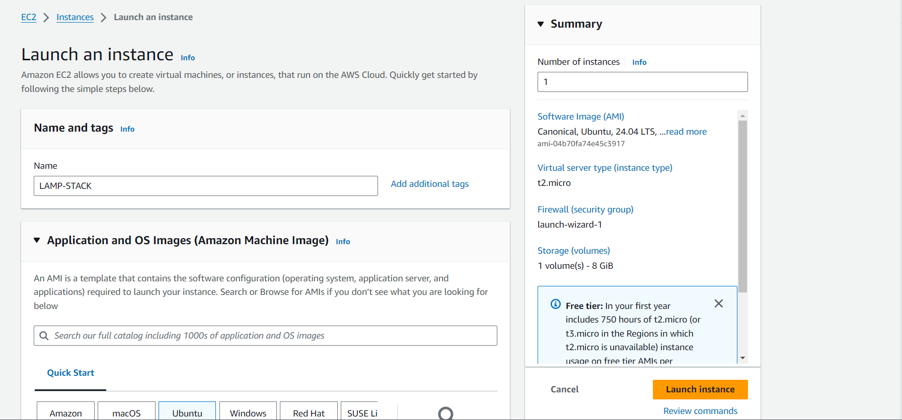
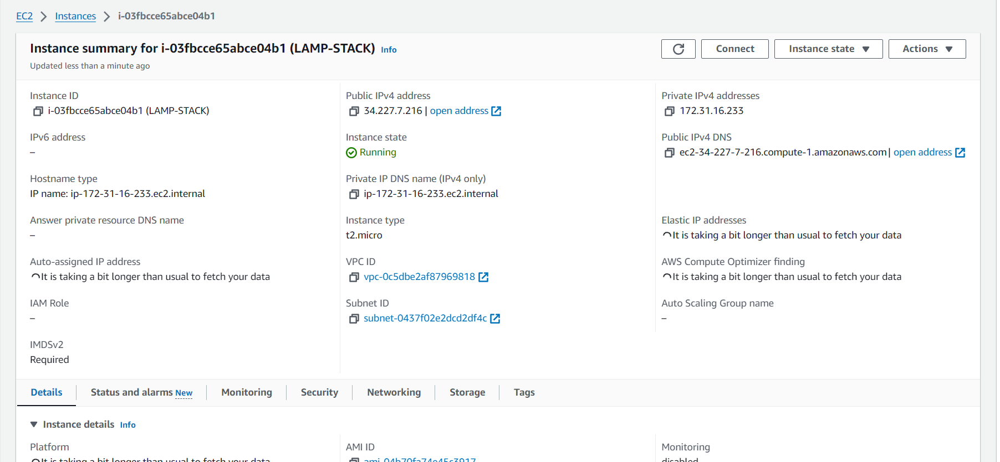<br><br>


2. The security group was configured with the following inbound rules:

- Allow traffic on port 80 (HTTP) with source from anywhere on the internet.
- Allow traffic on port 443 (HTTPS) with source from anywhere on the internet.
- Allow traffic on port 22 (SSH) with source from any IP address. This is opened by default.
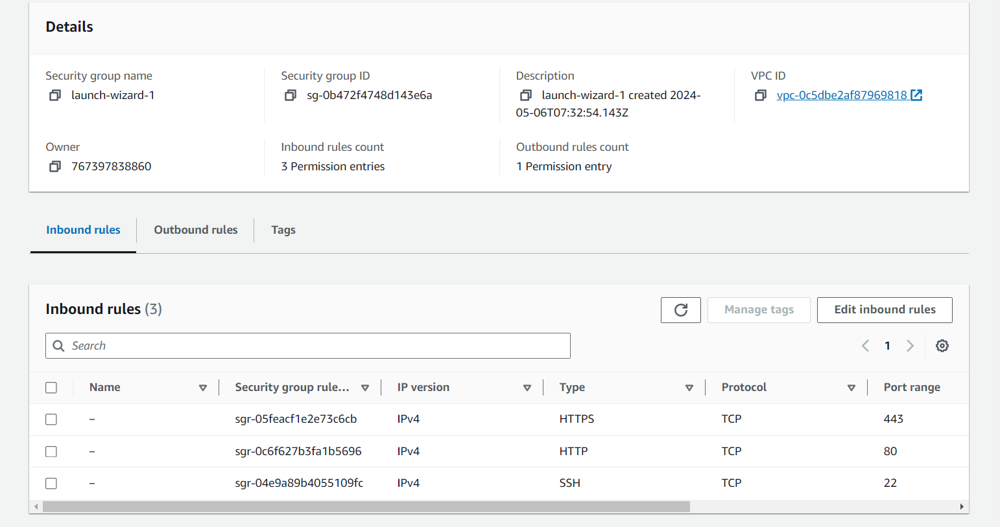<br><br>

3. Let's Connect our instance using SSH, then `cd` into the folder where the `private-key` was downloaded then ssh into it


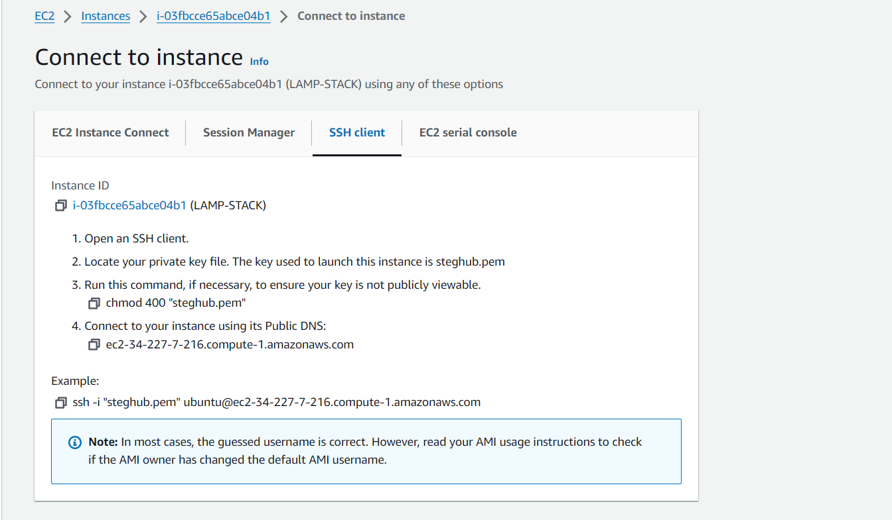<br><br>

```bash 
cd desktop

chmod 400 steghub.pem

ssh -i "steghub.pem" ubuntu@ec2-34-227-7-216.compute-1.amazonaws.com
```
<br>

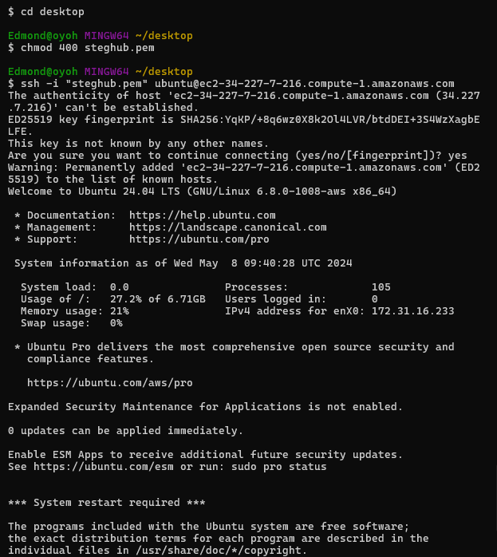<br><br>


## Step 1 - Install Apache and Update the Firewall
1. Update and upgrade list of packages in package manager

```bash
sudo apt update
sudo apt upgrade -y
```
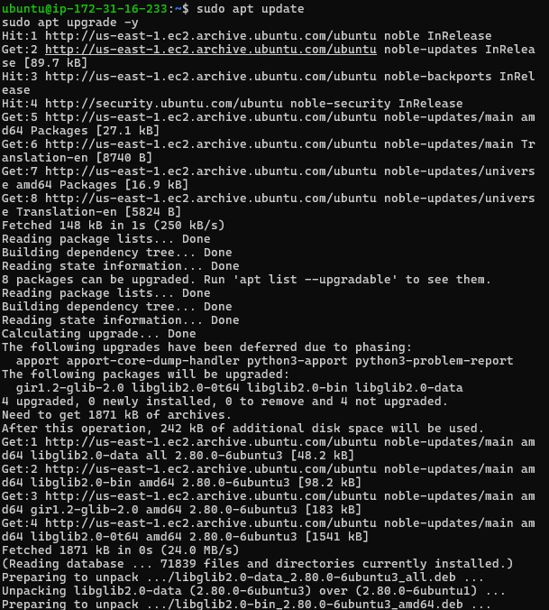<br><br>

2. Run apache2 package installation

```bash
sudo apt install apache2 -y
```
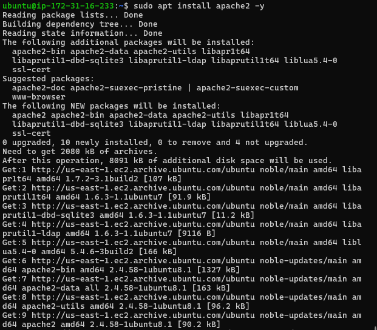<br><br>

3. Enable and verify that apache is running on as a service on the OS.

```bash
sudo systemctl enable apache2
sudo systemctl status apache2
```

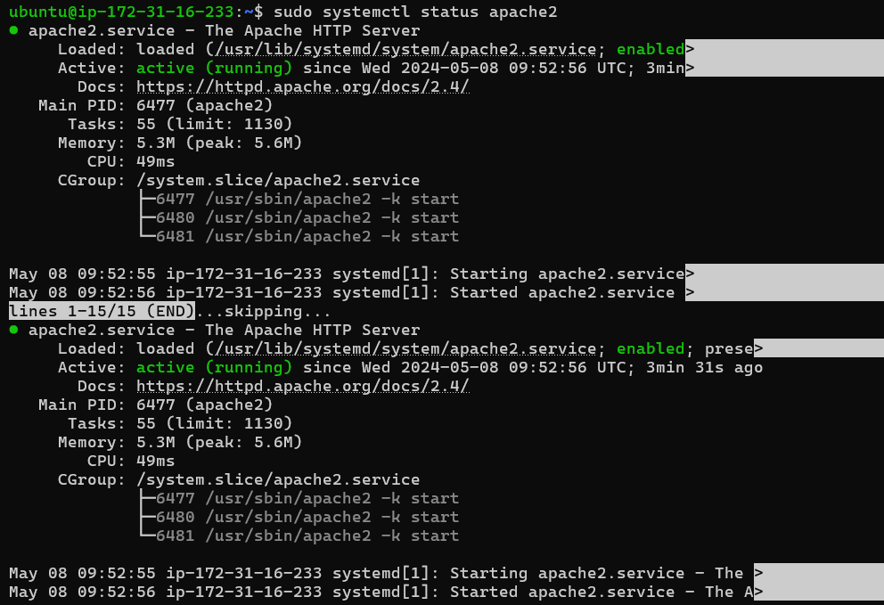<br><br>

4. The server is running and can be accessed locally in the ubuntu shell by running the command below:

```bash
curl http://localhost:80
OR
curl http://34.227.7.216:80
```

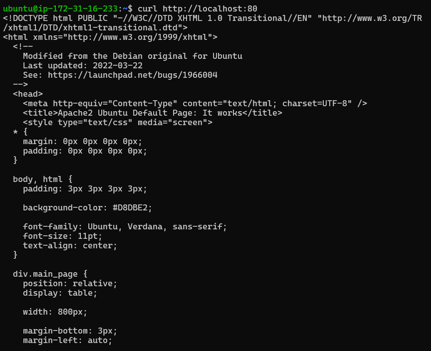<br><br>

5. Test with the public IP address if the Apache HTTP server can respond to request from the internet using the url on a browser.

```
http://184.72.210.143:80
```

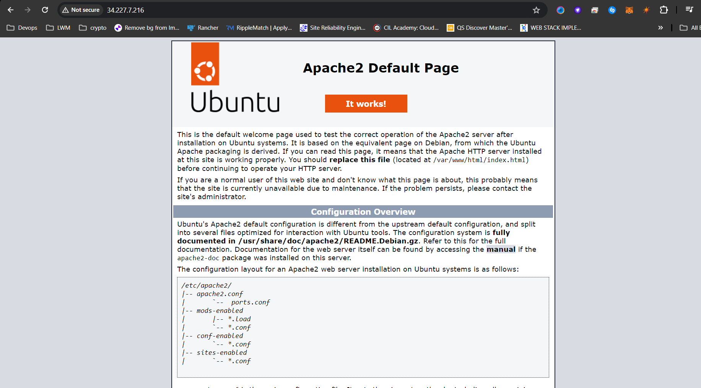<br><br>

## Step 2 - Install MySQL
1. Install a relational database (RDB)

MySQL was installed in this project. It is a popular relational database management system used within PHP environments.

```bash
sudo apt install mysql-server
```
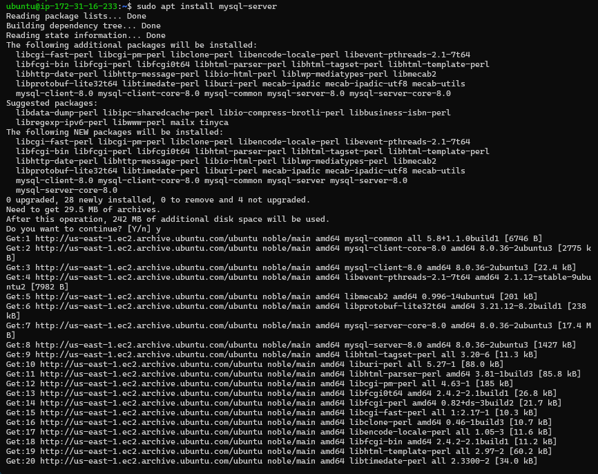<br><br>

_When prompted, install was confirmed by typing y and then Enter._

2. Enable and verify that mysql is running with the commands below
```bash
sudo systemctl enable --now mysql
sudo systemctl status mysql
```
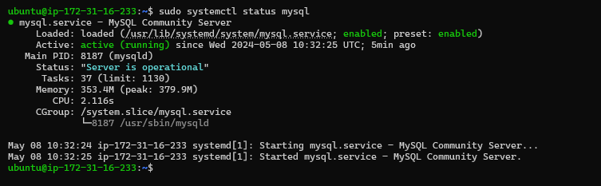<br><br>

3. Log in to mysql console

```bash
sudo mysql
```
This connects to the MySQL server as the administrative database user root infered by the use of sudo when running the command.

4. Set a password for root user using mysql_native_password as default authentication method.

Here, the user's password was defined as "Pswd@@"
```bash
ALTER USER 'root'@'localhost' IDENTIFIED WITH mysql_native_password BY 'Pswd@@';
```
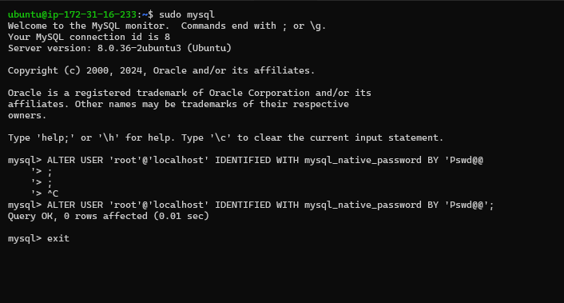<br><br>

Exit the MySQL shell

```bash
exit
```

## Step 3 - Install PHP
1. Install php Apache is installed to serve the content and MySQL is installed to store and manage data. PHP is the component of the set up that processes code to display dynamic content to the end user.

The following were installed:

- php package
- php-mysql, a PHP module that allows PHP to communicate with MySQL-based databases.
- libapache2-mod-php, to enable Apache to handle PHP files.
```bash
sudo apt install php libapache2-mod-php php-mysql
```
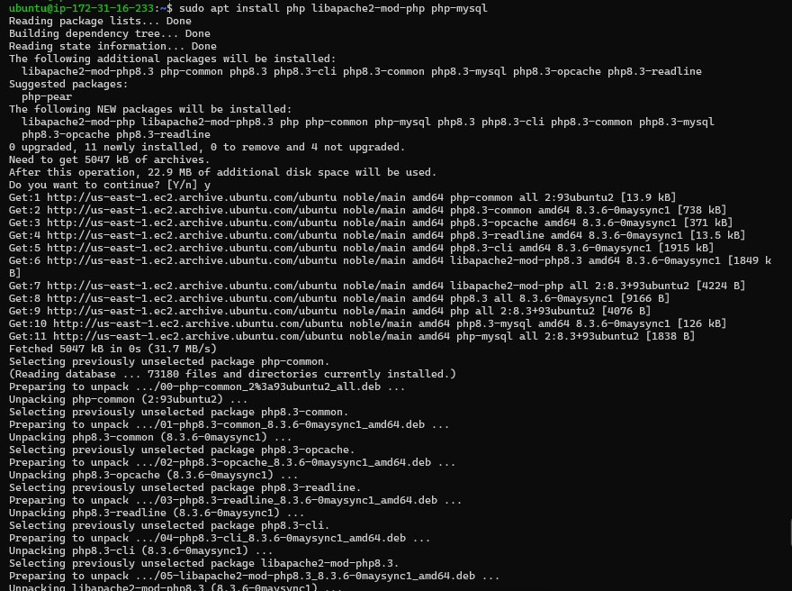<br><br>

Confirm the PHP version

```bash
php -v
```
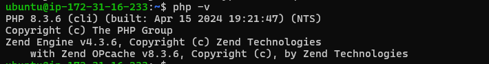


**At this ponit, the LAMP stack is completely installed and fully operational.**

To tset the set up with a PHP script, it's best to set up a proper Apache Virtual Host to hold the website files and folders. Virtual host allows to have multiple websites located on a single machine and it won't be noticed by the website users.

## Step 4 - Create a virtual host for the website using Apache
1. The default directory serving the apache default page is /var/www/html. Create your document directory next to the default one.

Created the directory for projectlamp using `mkdir` command

```bash
sudo mkdir /var/www/projectlamp
```
Assign the directory ownership with $USER environment variable which references the current system user.

```bash 
sudo chown -R $USER:$USER /var/www/projectlamp  
```
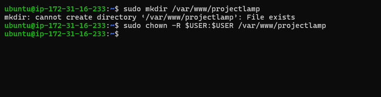

2. Create and open a new configuration file in apache’s “sites-available” directory using vim.
```bash
sudo vim /etc/apache2/sites-available/projectlamp.conf
```

Paste in the bare-bones configuration below:
```bash
<VirtualHost *:80>
  ServerName projectlamp
  ServerAlias www.projectlamp
  ServerAdmin webmaster@localhost
  DocumentRoot /var/www/projectlamp
  ErrorLog ${APACHE_LOG_DIR}/error.log
  CustomLog ${APACHE_LOG_DIR}/access.log combined
</VirtualHost>
```
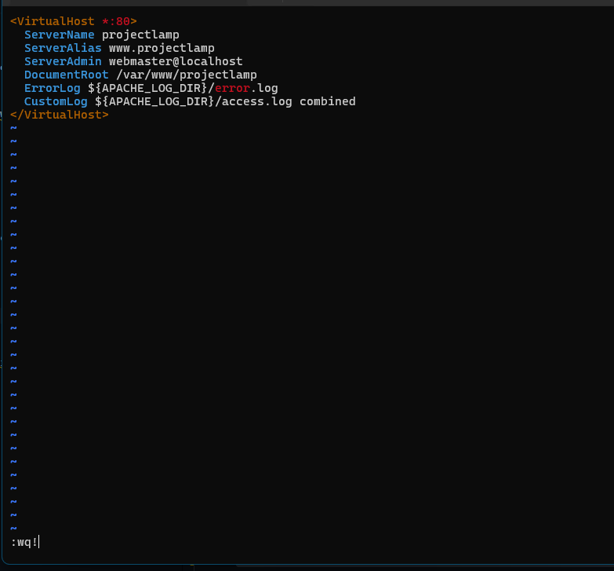

3. Show the new file in sites-available
```bash
sudo ls /etc/apache2/sites-available

Output:
000-default.conf default-ssl.conf projectlamp.conf
```
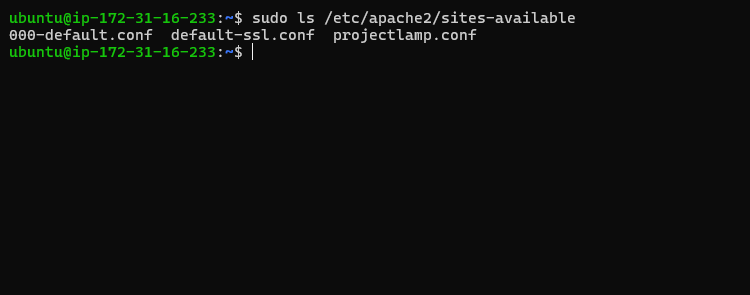

_With the VirtualHost configuration, Apache will serve projectlamp using /var/www/projectlamp as its web root directory._

4. Enable the new virtual host

```bash
sudo a2ensite projectlamp
```

5. Disable apache’s default website.

This is because Apache’s default configuration will overwrite the virtual host if not disabled. This is required if a custom domain is not being used.
```bash
sudo a2dissite 000-default
```
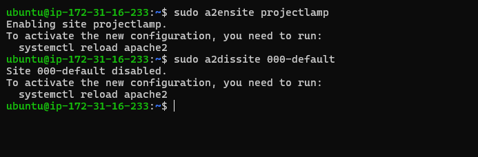

6. Ensure the configuration does not contain syntax error

The command below was used:

```bash 
sudo apache2ctl configtest
```

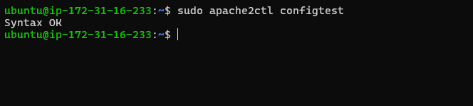

7. Reload apache for changes to take effect.

```bash
sudo systemctl reload apache2
```
8. The new website is now active but the web root /var/www/projectlamp is still empty. Create an index.html file in this location so to test the virtual host work as expected.

```bash
nano /var/www/projectlamp/index.html
```
Include the following content in this file:

```bash
<html>
  <head>
    <title>your_domain website</title>
  </head>
  <body>
    <h1>Hello World!</h1>

    <p>This is the landing page of <strong>your_domain</strong>.</p>
  </body>
</html>
```
Save `ctrl + x`and close `y` the file, then go to your browser and access your server’s domain name or IP address:

9. Open the website on a browser using the public IP address.

```bash
http://34.227.7.216/
```
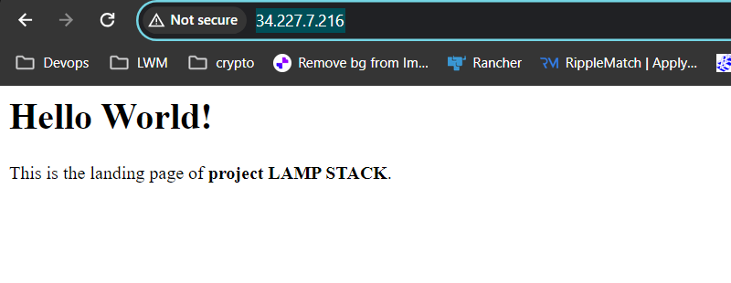

## Step 5 - Enable PHP on the website
With the default DirectoryIndex setting on Apache, index.html file will always take precedence over index.php file. This is useful for setting up maintenance page in PHP applications, by creating a temporary index.html file containing an informative message for visitors. The index.html then becomes the landing page for the application. Once maintenance is over, the index.html is renamed or removed from the document root bringing back the regular application page. If the behaviour needs to be changed, /etc/apache2/mods-enabled/dir.conf file should be edited and the order in which the index.php file is listed within the DirectoryIndex directive should be changed.

1. Open the dir.conf file with vim to change the behaviour

```bash
sudo vim /etc/apache2/mods-enabled/dir.conf
```
```
<IfModule mod_dir.c>
  # Change this:
  # DirectoryIndex index.html index.cgi index.pl index.php index.xhtml index.htm
  # To this:
  DirectoryIndex index.php index.html index.cgi index.pl index.xhtml index.htm
</IfModule>
```
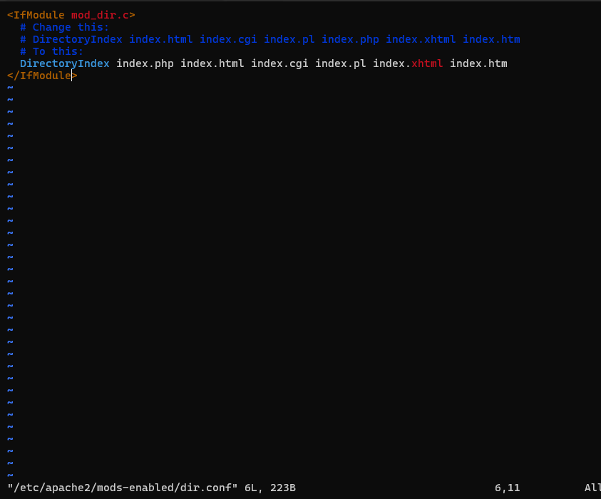

2. Reload Apache

Apache is reloaded so the changes takes effect.

```bash
sudo systemctl reload apache2
```

3. Create a php test script to confirm that Apache is able to handle and process requests for PHP files.

A new index.php file was created inside the custom web root folder.
```bash
vim /var/www/projectlamp/index.php
```
Add the text below in the index.php file

```bash
<?php
phpinfo();
```
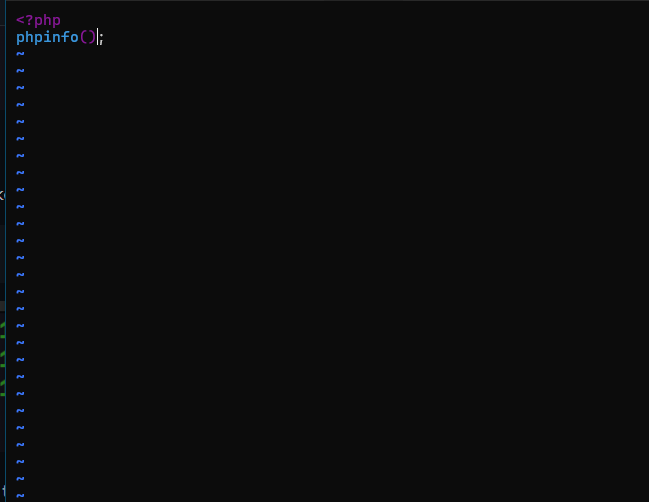

4. Now refresh the page `http://34.227.7.216/`

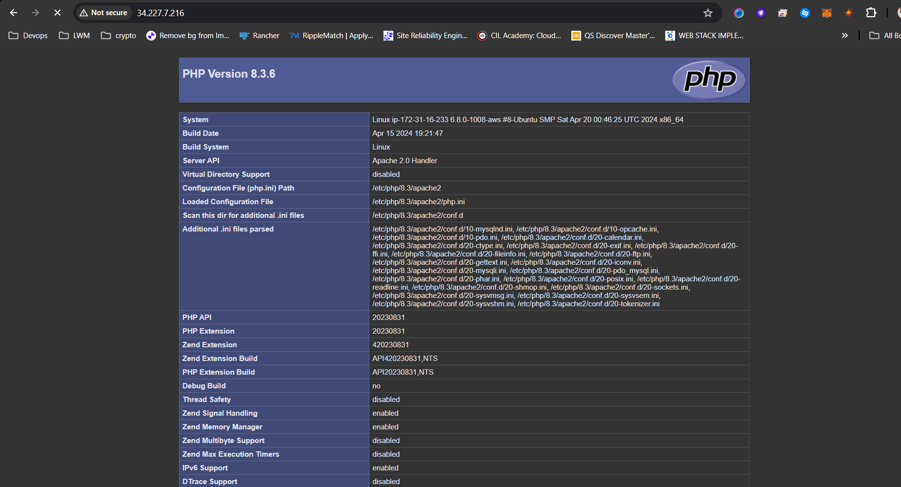

This page provides information about the server from the perspective of PHP. It is useful for debugging and to ensure the settings are being applied correctly.

After checking the relevant information about the server through this page, It’s best to remove the file created as it contains sensitive information about the PHP environment and the ubuntu server. It can always be recreated if the information is needed later.

```bash
sudo rm /var/www/projectlamp/index.php
```

Conclusion:

The LAMP stack provides a robust and flexible platform for developing and deploying web applications. By following the guidelines outlined in this documentation, It was possible to set up, configure, and maintain a LAMP environment effectively, enabling the creation of powerful and scalable web solutions.

# Extra

## Step 5 — Testing Database Connection from PHP (Optional)
If you want to test whether PHP is able to connect to MySQL and execute database queries, you can create a test table with test data and query for its contents from a PHP script. Before you do that, you need to create a test database and a new MySQL user properly configured to access it.

Create a database named example_database and a user named example_user. You can replace these names with different values.

1. First, connect to the MySQL console using the root account:

```bash
$ sudo mysql -p

Enter password:
`Pswd@@`
```
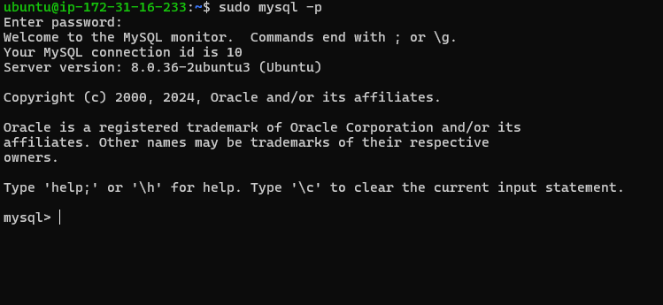

2. To create a new database, run the following command from your MySQL console:
```bash
mysql> CREATE DATABASE steghub_DB;
mysql> SHOW DATABASES;
```
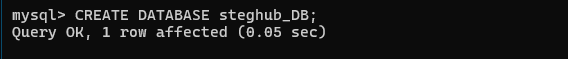

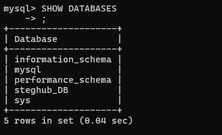

3. Next, create a test table named todo_list. From the MySQL console, run the following statement:

```bash
mysql> CREATE TABLE steghub_DB.todo_list (
mysql> item_id INT AUTO_INCREMENT,
mysql> content VARCHAR(255),
mysql> PRIMARY KEY(item_id)
);
```
4. Insert a few rows of content in the test table. Repeat the next command a few times, using different values, to populate your test table:

```bash 
mysql> INSERT INTO steghub_DB.todo_list (content) VALUES ("My first important item");
```

5. To confirm that the data was successfully saved to your table, run:

```bash 
SELECT * FROM steghub_DB.todo_list;
```

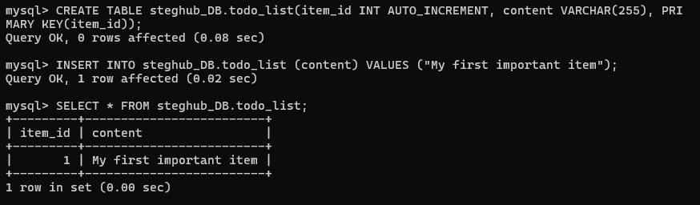

6. After confirming that you have valid data in your test table, exit the MySQL console:

```bash
mysql> exit
```

Now you can create the PHP script that will connect to MySQL and query for your content. Create a new PHP file in your custom web root directory using your preferred editor:

```bash
nano /var/www/projectlamp/todo_list.php
```
save `ctrl + x`, exit `y` then press `enter`

The following PHP script connects to the MySQL database and queries for the content of the todo_list table, exhibiting the results in a list. If there’s a problem with the database connection, it will throw an exception.

Add this content into your todo_list.php script, remembering to replace the example_user and password with your own:

```bash
<?php
$user = "root";
$password = "Pswd@@";
$database = "steghub_DB";
$table = "todo_list";

try {
  $db = new PDO("mysql:host=localhost;dbname=$database", $user, $password);
  echo "<h2>TODO</h2><ol>";
  foreach($db->query("SELECT content FROM $table") as $row) {
    echo "<li>" . $row['content'] . "</li>";
  }
  echo "</ol>";
} catch (PDOException $e) {
    print "Error!: " . $e->getMessage() . "<br/>";
    die();
```

You can now access this page in your web browser by visiting the domain name or public IP address configured for your website, followed by /todo_list.php:

```bash
http://34.227.7.216//todo_list.php
```
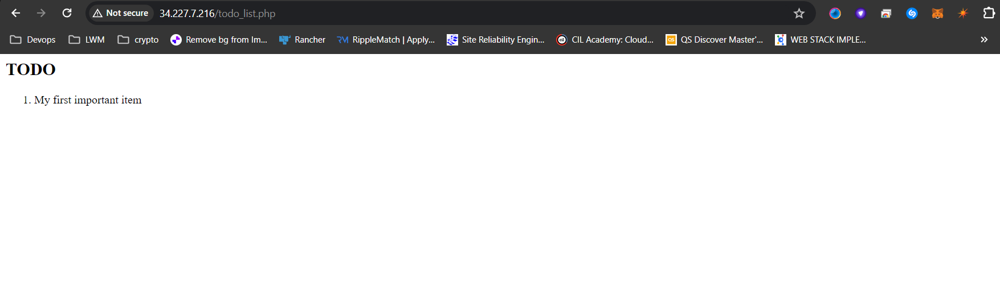

That means your PHP environment is ready to connect and interact with your MySQL server.

**Conclusion<br>**
In this guide, you’ve built a flexible foundation for serving PHP websites and applications to your visitors, using Apache as a web server and MySQL as a database system.